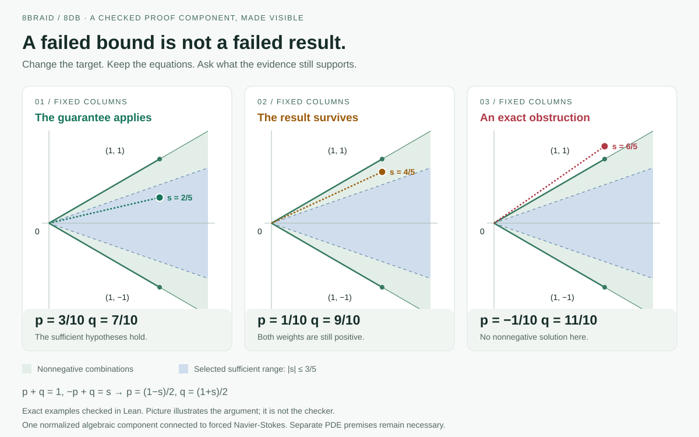

# The proof passed. Can you see why it works?

**A visual companion to one algebraic step in the forced Navier-Stokes construction. Updated 15 September 2026.**

A failed mathematical bound can look like a failed result. In our example, the bound stops applying while the result still holds. Push the same example further and it really does become impossible. The difference fits in one picture.

We built this companion at 8Braid while working with OpenAI's released Navier-Stokes construction. It connects an offline interactive diagram to a standalone Lean lemma and five checked statements about selected examples.[1] A reader can change the target, see the weights change, and inspect the statement that supports each named case.

That is a useful next step for AI-assisted mathematics: make the reason available for inspection alongside the checking record.

## A piece of the argument you can draw

Take two vectors, (1,−1) and (1,1). Can positive amounts of them combine into the target (1,s)?

Call the amounts p and q. The first coordinate gives p + q = 1. The second gives −p + q = s. Solving these two equations gives:

**p = (1−s)/2, q = (1+s)/2.**

When s = 2/5, the weights are 3/10 and 7/10. Both are positive. In the intended covariance construction, these weights represent normalized squared amplitudes, so positivity matters.

Now allow uncertainty in the two vectors. Our lemma places the target a distance m from the endpoints and allows each matrix entry to change by at most m/4. It proves that the determinant and the two numerators used to calculate the weights remain positive. The reconstructed target is exact.[2]

The underlying reason is simple: spare room around the target pays for uncertainty in the directions. The one-quarter allowance is sufficient; we make no optimality claim.

## What happens when the guarantee expires?

Fix m = 2/5. The selected guarantee covers |s| ≤ 3/5. Moving the target to s = 4/5 leaves that range, but the original vectors still give positive weights: 1/10 and 9/10.

Move to s = 6/5 and the weights become −1/10 and 11/10. The equations force a negative weight. There is no nonnegative solution for those fixed vectors and that target.

These are different outcomes. The first change requires another argument. The second has an exact obstruction. The worked examples include Lean statements for both, plus a perturbed case that the general guarantee covers.[1]

A research system needs to preserve this distinction whenever an AI proposes changing a premise. Otherwise it can discard a useful construction because one estimate is too conservative, or keep searching after the fixed equations already rule out its target.

## Where 8DB fits

Our database, 8DB, is being developed to keep claims, their joint premises, derivations and checking evidence connected as research changes. This public companion makes one part of that approach inspectable without access to the private engine. It supplies the explanation, formal source, exact examples and recorded checks.

The local algebra relates to covariance inversion in the forced Navier-Stokes construction. Applying it to the actual fluid fields still requires the analytic estimates and geometric hypotheses listed with the lemma.[2] The repository also records our earlier replay of the authors' formal targets, with its source and environment identities.[3] The visual explains one component of that work.

Stephen Wolfram's question about understanding machine-generated proofs helped motivate this direction.[4] Here, the human test is concrete: after exploring the picture, can someone predict which changed examples still work and explain why? We have not measured that yet.

**[Download the companion](README.md), open `index.html`, and try the “Outside sufficient box” example.** It runs offline in a browser, with no account. Before selecting the next example, predict which weight will cross zero.

## Notes

1. [Worked examples](WorkedExamples.lean) and [the replay record](REPLAY.md). The five statements concern exact rational examples. The browser uses floating-point display calculations; the Lean statements supply the formal checks for the named cases. The diagram itself is an illustration.
2. [Standalone covariance lemma and assumptions](../covariance/README.md). The source proves a sufficient bound over real parameters. Its application to the manuscript requires positive physical scales and column masses, an orthonormal frame, target-cone inclusion and analytic error estimates. Zero-target extension has additional obligations.
3. [Historical upstream replay receipt](../formal-replay/receipt.json). This summarizes project replay results for the released authors' formalization. The repository distinguishes that historical record from the runnable standalone lemma and the private native database experiment.
4. Stephen Wolfram, [Who Can Understand the Proof? A Window on Formalized Mathematics](https://writings.stephenwolfram.com/2025/01/who-can-understand-the-proof-a-window-on-formalized-mathematics/), 9 January 2025. His challenge concerns a different theorem, about Boolean algebra. It motivates the question about understanding; this companion makes no claim to solve that challenge.
